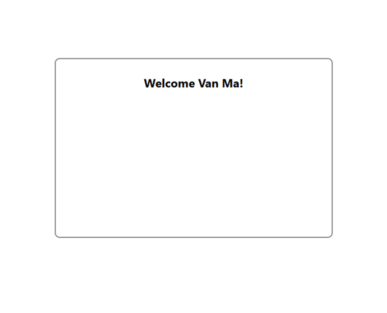

# Google OAuth Demo
This is a simple demo project showing how to implement Google OAuth login using a React frontend and a Flask backend. 

## Features

- Sign in with Google account
- Display logged-in user name
- Session management with Flask
- Logout functionality
- Simple responsive login page

## Requirements

- Python 3.x
- Node.js / npm
- Google OAuth credentials
 
## Instructions

### Backend
1. pip install -r requirements.txt  
2. create .env file in backend folder with Google OAuth credentials:  
   FLASK_SECRET_KEY=your_secret_key  
   GOOGLE_CLIENT_ID=your_google_client_id  
   GOOGLE_CLIENT_SECRET=your_google_client_secret  
3. run the Flask server:  
   python oauth/api.py  

### Frontend
1. navigate to the project folder  
2. npm install  
3. npm start  
